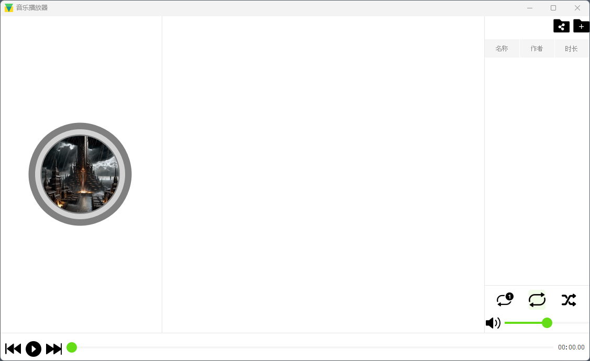

# Qt版本说明
$$\text{Qt} \text{版本} = 5.15.2$$

## 运行环境
- Windows 10
- Visual Studio 2019
- Qt 5.15.2 MSVC2019 64-bit

## 功能说明
- 播放本地音乐
- 播放网络音乐
- 播放列表循环播放
- 播放单曲循环播放
- 播放随机播放
- 播放暂停/恢复
- 播放进度调整
- 播放音量调整
- 播放音乐信息显示
- 播放音乐封面显示
- 播放音乐列表显示
- 播放音乐下载功能
- 播放音乐分享功能
- 播放音乐播放模式切换功能
- 播放音乐播放器界面美化功能 
## 编译教程
- 下载源码
- 安装Qt5.15.2 MSVC2019 64-bit
- 打开QtCreator/vscode
- 打开项目文件
- 编译项目
## 运行说明
- 没有配置前第一次运行如下图所示:

- 将源码中openssl目录下的dll文件拷贝到可执行文件所在目录
- 将源码styles文件夹拷贝到可执行文件所在目录
- 再次运行程序
